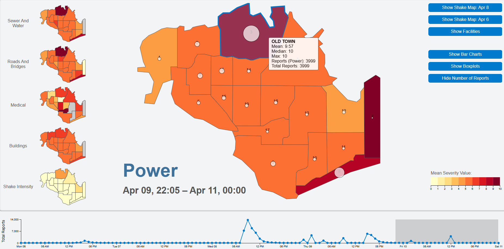
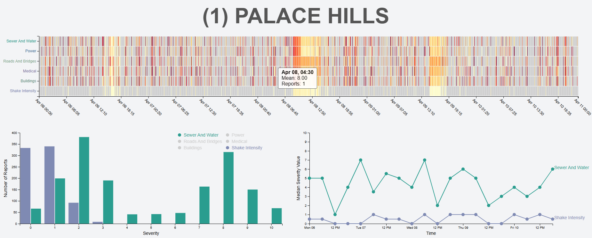

# VAST Challenge 2019: Disaster at St. Himark!
## Mini-Challenge 1: Crowdsourcing for Situational Awareness

Personal implementation of the [VAST Challenge 2019](https://vast-challenge.github.io/2019/index.html), [Mini Challenge 1](https://vast-challenge.github.io/2019/MC1.html).
Developed for academic purposes and **not submitted** as an official challenge entry.

📄 [Project Report (PDF)](St__Himark.pdf)

---

## Overview

This project presents an interactive visual analytics tool for exploring crowd-sourced reports collected after a simulated earthquake in the fictional city of St. Himark.

The application offers both a high-level overview of the city and detailed analysis of the situation in individual neighborhoods over time, supporting quick and informed decision-making during emergency response.

---

## Features
- Set of choropleth maps providing a high-level overview of reported damage across the entire city
- Overlays including report counts, uncertainty levels, shake maps, or key city infrastructure
- Interactive timeline (line chart) showing the number of reports over time, also used for temporal filtering
- Detailed view of a selected region combining heatmap, grouped bar chart, and line chart for in-depth analysis of reports in the region
- Tooltips providing statistical summaries for each region or time point

### City Overview

### Detailed Region View

---

## Technologies
- JavaScript
- D3.js
- HTML
- CSS

---

## Run the Application Locally
1. Clone the repository
2. Install dependencies: npm install
3. Start the server: node index.js
4. The app runs on port 5000 (http://localhost:5000/)
